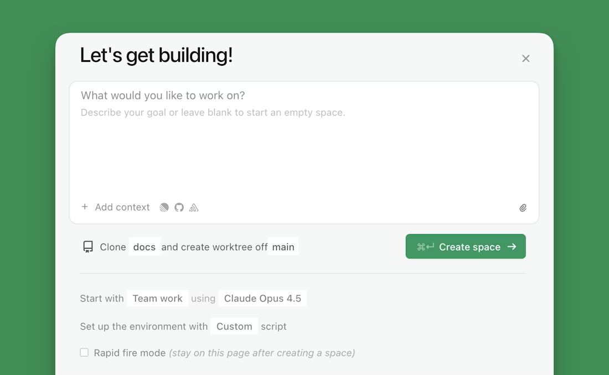
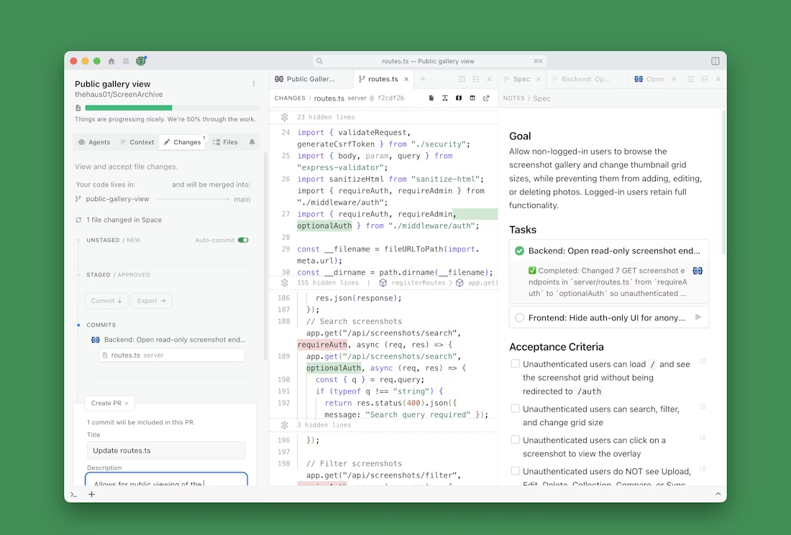

# Kata Cloud (Kata V2)

## Context

Kata currently provides two open source projects:

**Kata Agents** - Desktop application for AI agents across macOS, Windows, and Linux. Multi-session inbox, MCP integration, and a professional interface for AI workflows.

  - GitHub: https://github.com/gannonh/kata-agents
  - Landing Page: https://kata.sh/agents
  - Local path: /Users/gannonhall/dev/kata/kata-agents

**Kata Orchestrator** - Claude Code plugin for spec-driven development. Multi-agent CLI with natural language workflow automation, atomic git commits, and fresh context windows per agent.

  - GitHub: https://github.com/gannonh/kata-orchestrator
  - Landing Page: https://kata.sh/orchestrator
  - Local path: /Users/gannonhall/dev/kata/kata-orchestrator

A third project, Kata Context exists in concept only: 
  
**Kata Context** - High-quality semantic search to AI agents and applications

  - Vision: [doc](kata-context.md)

All three products share the "kata" philosophy: deliberate structure enabling flexibility through spec-driven workflows, clean abstractions, and contextual understanding.

These projects have served as R&D for what will become Kata's commercial venture, which brings together all three ideas into a single product offering: Kata Cloud. This is that project.

## Introducing Kata Cloud

> A desktop app for spec-driven development.

## About Kata

Kata is both a **spec-driven development app** and an **agent orchestration app**. These are two exciting paradigms that work together: specs keep your project aligned while multiple specialized agents execute work in parallel. The result is a new way to build software where you focus on outcomes and agents handle implementation.

## What is spec-driven development?

Spec-Driven Development puts the spec at the center of your workflow. Instead of writing code and hoping it matches the plan, you write the spec and let agents implement it. As they work, the spec updates to reflect what was actually built.

Specs that are always accurate, agents that stay aligned, and code that matches intent.

## How are Kata's specs different?

When an agent completes work, the spec updates to reflect reality. When requirements change, updates propagate to all active agents. No more "what did we decide?" No more outdated PRDs. The spec is the source of truth because it maintains itself.

***

## Key concepts

### Spaces

When you create a prompt in Kata , it automatically creates a **Space** with its own dedicated git branch and worktree. This isolated environment allows agents to work on your code without affecting your main branch.

### Orchestrator of specialized agents

Kata's multi-agent model mirrors how teams actually work.

The **Coordination Agent** breaks down your spec into tasks. Specialist agents execute in parallel, each in their own context. The Orchestrator keeps everything aligned and handles handoffs.

When you submit a prompt, the Orchestrator:

1. **Analyzes your codebase** to understand the context and requirements
2. **Drafts a Spec** that serves as a living document for the project
3. **Generates tasks** for specialized agents to execute

You can stop the Orchestrator at any time to manually edit the Spec, giving you full control over the direction of the work.

### The spec: your project's source of truth

The **Spec** is a self-maintaining document that serves as a running summary of:

* The project goals and requirements
* Tasks that need to be completed
* Work that has been done
* Assumptions, tradeoffs, and decisions

As the code changes, the Spec stays aligned and updated, ensuring developers and agents always work from the same context.

### Parallel work

The Orchestrator organizes work into coordinated efforts, assigning specialized agents to tackle specific tasks. Multiple agents can work in parallel on different aspects of the project, all staying synchronized through the shared spec.

Run as many agents as the task needs. Kata keeps them in sync.

### Review, stage, and merge

When agents complete their tasks, Kata notifies you. Navigate to the **Changes tab** to inspect all diffs and modifications made by the agents.

From the Changes tab, you can:

* **Inspect diffs** - Review all code changes side-by-side
* **Create a PR** - Generate a pull request directly from the interface
* **Auto-fill PR description** - Let the agent automatically generate a comprehensive PR description based on the work completed
* **Stage changes** - Select which changes to include
* **Merge** - Integrate the completed work back into your main branch

This workflow gives you full visibility and control over agent generated code changes, completing the cycle from Kata to PR.

### Specialist agents

Kata includes **6 specialist agent personas**, each designed for specific types of work. You can also create custom specialists in **Settings** to tailor agents to your specific workflow:

Investigate
Explore codebase, assess feasibility

Implement
Execute implementation plans

Verify
Check implementations match specs

Critique
Review specs for feasibility

Debug
Analyze and fix issues

Code Review
Automated reviews with severity

The Orchestrator assigns the right specialist for each task, ensuring expert-level execution across all aspects of your project.

### All agents are powered by the Context Engine

A multi-agent world needs even better context. Every agent in Kata is powered by Kata's industry-leading Context Engine (in development). Whether it's the Orchestrator planning your work or specialists executing tasks, they all share deep understanding of your entire codebase.

***

## Quickstart

Download and Install Kata
Download the MacOS app from kata.sh. Linux coming soon. Install the application and launch Kata.

Create Your First Space
Describe your project in the prompt box and click **Create space** under the prompt box. Choose a name and location for your space, optionally link a Git repository, and add a description and tags for organization.

Your first session with the Orchestrator
Your space opens with the Explorer to the left, Orchestrator in the center, and the intial draft of the Spec to the right.

***

## Key features

### Space management

Organize your development projects efficiently:

* **Multiple Spaces**: Create separate spaces for different projects
* **Rich Metadata**: Add descriptions, tags, and custom properties
* **Git Integration**: View diffs, track changes, and manage repositories
* **Activity Logging**: Comprehensive tracking of all space activities
* **File Organization**: Track and manage project files with change detection

### Code editor

Built-in code editing with professional features:

* **Syntax Highlighting**: Support for 20+ programming languages
* **CodeMirror Powered**: Industry-standard editor component
* **Diff Viewer**: Side-by-side comparison of file changes
* **Git Integration**: View and manage code changes inline

### In-app browser

Stop switching between your IDE, terminal, browser, and git client. Intent has a **built-in Chrome browser** for previewing local changes. Preview your app without leaving the space.

### Agent integration

Not every task needs the same model. Intent supports all major state-of-the-art models — mix and match based on what each task needs:

* **Opus 4.5** — Complex architecture and planning
* **Sonnet 4.5** — Rapid iteration
* **GPT 5.2** — Deep code analysis and code review
* **Haiku** — Fast, lightweight tasks

### MCP support

Full [Model Context Protocol](https://modelcontextprotocol.io) (MCP) support. Connect external tools and data sources to extend what your agents can do — access databases, documentation, APIs, and more without leaving Intent.

### Resumable sessions

Pick up exactly where you left off. Your space state persists across sessions — close Intent, reopen it tomorrow, and everything is exactly as you left it.

* **Auto-commit** — Work is captured automatically as agents complete tasks
* **Branch Management** — Branch creation, switching, and management built-in
* **Persistent State** — Your progress is always saved

### Notes

Keep your project documentation organized:

* **Markdown Support**: Rich text editing with TipTap editor
* **Tags & Organization**: Categorize notes with custom tags
* **Full-Text Search**: Quickly find notes across all spaces
* **Comments**: Add threaded comments to notes for collaboration
